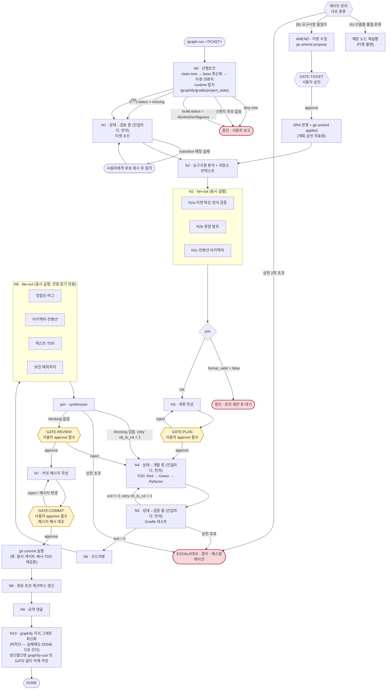

# 엣지 명세

## 다이어그램

## 엣지 조건표

| # | From | To | 종류 | 조건 | 판정 주체 |
|---|---|---|---|---|---|
| E0 | 진입 | N0 | 순차 | `/graph-run <TICKET>` | 커맨드 |
| E1 | N0 | N1 | 순차 | 티켓 브랜치 체크아웃 완료 + 탐지 완료 | 오케스트레이터 |
| E1x | N0 | 중단 | 실패 | dirty tree / base 후보 없음 / build blocked·ambiguous | 오케스트레이터 |
| E2 | N1 | N2 | 순차 | 목표 상태(`검토 중`) 전이 성공 + 원문 수신 | 오케스트레이터 |
| E2x | N1 | 질의 | 실패 | `to.name` 매칭 실패 | 오케스트레이터 |
| E3 | N2 | N3 | 순차 | `requirements.format_valid == true` && `acceptance_criteria` ≥ 1 | join |
| E3x | N2 | 정지 | 실패 | 양식 위반 → 초안 제안 후 대기 | join |
| **E4** | **N3** | **N4** | **승인 게이트** | `gates.approvals` 에 GATE-PLAN approved && `artifact_hash == plan.hash` | **UserPromptSubmit 훅 + PreToolUse 훅** |
| E5 | N4 | N5 | 순차 | 구현 완료 선언 → N5 진입 전 `검증 중` 전이 | `ge jira-transition` + `ge node` |
| E6 | N5 | N6 | 순차 | 테스트 `exit_code == 0` | `ge record-test` |
| **E6r** | **N5** | **N4** | **조건부 역방향** | `exit_code != 0` && `retries.n5_to_n4 < 3` — 복귀 진입에도 `개발 중` 재전이 필요 | `ge retry --edge n5_to_n4` |
| E6e | N5 | ESCALATED | 상한 | `retries.n5_to_n4 >= 3` (CLI exit 3) | `ge retry` |
| E7 | N6 | GATE-REVIEW | 순차 | blocking findings 없음 | synthesizer |
| **E7r** | **N6** | **N4** | **조건부 역방향** | blocking 있음 && `retries.n6_to_n4 < 2` | `ge retry --edge n6_to_n4` |
| E7e | N6 | ESCALATED | 상한 | `retries.n6_to_n4 >= 2` | `ge retry` |
| **E8** | **N6** | **N7** | **승인 게이트** | GATE-REVIEW approved | **UserPromptSubmit 훅 + `ge node N7`** |
| **E9** | **N7** | **commit** | **승인 게이트** | GATE-COMMIT approved && `artifact_hash == sha256(실제 커밋 메시지)` | **PreToolUse Bash 훅** |
| E10 | commit | N8 | 순차 | 커밋 해시 존재 | 오케스트레이터 |
| E11 | N8 | N9 | 순차 | 체크박스 갱신 완료(또는 사용자에게 위임) | 오케스트레이터 |
| E12 | N9 | **N10** | 순차 | 댓글 등록 | 오케스트레이터 |
| E13 | N10 | DONE | 순차 | graphify 최신화 완료 **또는 skipped/failed** (비차단). 갱신됐으면 `graphify-out/` 자체 커밋(GATE 없이, `config.commit.graphify` 조건 일치 시만) | `ge record-graphify`, `git commit` |
| **E14a** | GATE-* | **해당 노드** | **조건부(반려)** | 반려 사유 = **(A) 산출물 품질 문제** | 오케스트레이터 |
| **E14b** | GATE-* | **AMEND** | **조건부(반려)** | 반려 사유 = **(B) 요구사항 불일치** && `retries.gate_to_amend < 2` | `ge retry --edge gate_to_amend` |
| **E15** | AMEND | GATE-TICKET | 승인 게이트 | 티켓 수정안 제시 | `ge amend propose` + `ge gate open` |
| **E16** | AMEND | **N2** | 순차 | GATE-TICKET 승인 && JIRA 반영 완료 | `ge amend applied` (계획·승인 무효화) |
| E14e | GATE-* | ESCALATED | 상한 | `retries.gate_to_amend >= 2` | `ge retry` |

## 재시도 정책

| 엣지 | 상한 | 설정 키 | 초과 시 |
|---|---|---|---|
| N5 → N4 | 3 | `retries.n5_to_n4` | `node_status = escalated`, `halt_reason` 기록, CLI exit 3, 그래프 정지 |
| GATE-* → AMEND | 2 | `retries.gate_to_amend` | 동일. 요구사항이 아직 확정되지 않았다는 뜻이므로 사용자에게 넘긴다 |
| N6 → N4 | 2 | `retries.n6_to_n4` | 동일 |

- 카운터는 `ge retry --edge <edge>` 로만 올린다. 역방향 엣지를 타면서 카운터를 올리지 않는 경로는 없다.
- 상한 초과 시 오케스트레이터는 **즉시 멈추고** 다음을 보고한다: 남은 blocking/실패 목록,
  마지막 테스트 원문 로그 경로, 지금까지의 변경 파일, 제안하는 다음 수.

## 실패 격리

- 노드 실패는 `ge node <N> --status failed --note "<사유>"` 로 상태에 남기고, 표에 정의된
  엣지로만 빠져나간다. 실패한 노드의 부분 산출물을 다음 노드의 입력으로 쓰지 않는다.
- N2 fan-out 중 하나가 실패해도 나머지 결과는 유효하다. join 이 실패한 축만 재실행하거나
  `confidence: low` 로 표시해 N3 에서 사용자 확인을 받는다.
- N6 fan-out 중 하나가 실패하면 그 관점은 "검증되지 않음" 으로 표기된다.
  **검증되지 않은 관점을 통과로 간주하지 않는다.**
- **N10(graphify 최신화)은 비차단 노드다.** 실패해도 역방향 엣지를 타지 않고, 그래프를 멈추지도
  않는다. `graphify_update.status = failed` 로 사실을 남기고 DONE 으로 간다.
  맨 마지막에 둔 이유가 이것이다 — graphify 실패가 JIRA 보고(N8·N9)를 막으면 안 된다.
  대신 **실패를 성공으로 포장하지 않는다**: `ge record-graphify` 가 graph.json 을 실측 대조한다.
- 훅 차단(exit 2)은 노드 실패가 아니다. 차단 사유를 읽고 규칙을 지켜 다시 시도한다.
  같은 차단을 두 번 이상 만나면 우회하지 말고 사용자에게 보고한다.
